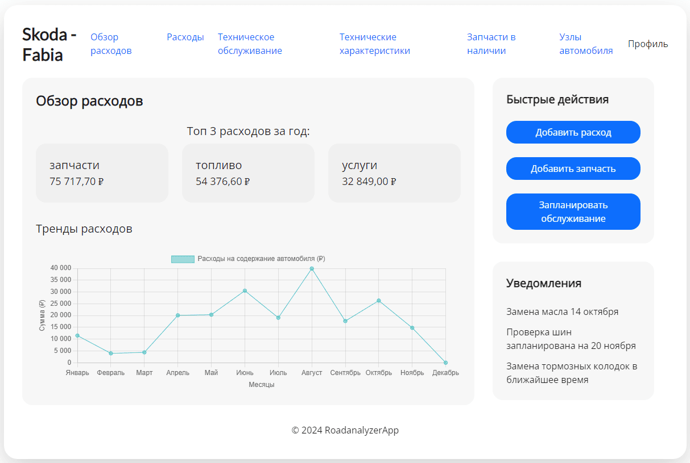
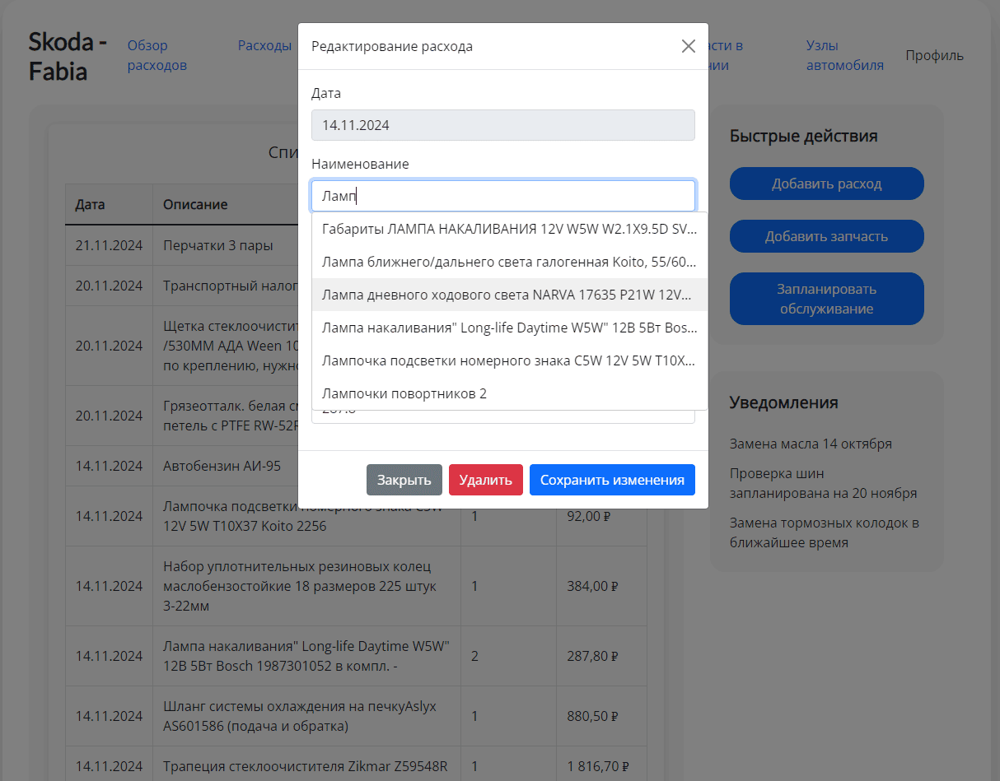
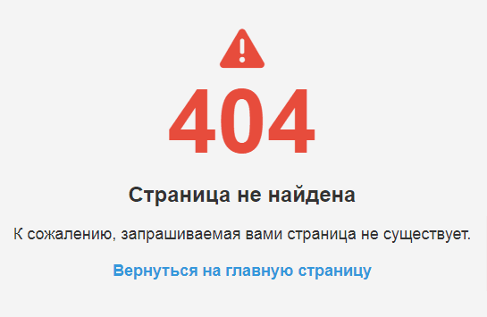

# RoadAnalyzer

**RoadAnalyzer** — это веб-приложение, предназначенное для контроля расходов и технического обслуживания автомобилей. Оно помогает пользователям отслеживать затраты на топливо, обслуживание и другие расходы, связанные с эксплуатацией автомобиля, а также управлять техническим состоянием транспортного средства.

## Актуальность приложения
В условиях растущих затрат на топливо и обслуживание автомобилей, а также необходимости эффективного управления техническим состоянием транспортных средств, приложение **RoadAnalyzer** становится особенно актуальным. Оно предоставляет пользователям инструменты для оптимизации расходов и повышения надежности их автомобилей

## Основные функции

- Учет расходов на топливо и обслуживание
- Напоминания о техническом обслуживании
- Генерация отчетов по расходам

## Установка и запуск

1. Клонируйте репозиторий:
   ```bash
   git clone https://github.com/mgrom-dev/RoadAnalyzer.git
   ```

2. Перейдите в директорию проекта:
    ```bash
    cd RoadAnalyzer
    ```

3. Запустите приложение:
    ```bash
    mvn spring-boot:run
    ```

## Технологии
- **Java**: Основной язык программирования.
- **Spring Boot**: Фреймворк для создания веб-приложений.
- **MySQL/PostgreSQL**: Система управления базами данных.
- **Thymeleaf**: Шаблонизатор для создания веб-интерфейса.
- **Bootstrap**: CSS-фреймворк для стилизации интерфейса.
- **jQuery**: Библиотека JavaScript для упрощения манипуляций с DOM.
- **Spring Security**: Обеспечивает безопасность приложения, включая аутентификацию и авторизацию пользователей.
- **Flyway**: Инструмент для управления миграциями базы данных, позволяющий легко обновлять структуру базы данных.
- **OpenCSV**: Библиотека для работы с CSV-файлами, используемая для миграции данных с Flyway и экспорта данных из базы данных в формат CSV.
- **Spring Boot Mail**: Библиотека для отправки электронных писем, которая предоставляет удобный способ интеграции функциональности отправки почты в приложении.

## Настройки

### Настройки верификации новых пользователей
Для настройки отправки электронных писем в приложении рекомендуется использовать почту Rambler, так как она предлагает высокий лимит на отправку сообщений — до 200 писем в час. Чтобы настроить отправку писем через SMTP-сервер Rambler, необходимо добавить соответствующие параметры в файл конфигурации application.yml или application.properties вашего Spring Boot приложения.
Пример конфигурации в application.yml:
```yml
spring:
  mail:
    verification-required: false
    host: smtp.rambler.ru
    port: 587
    username: YOUR_EMAIL@rambler.ru
    password: YOUR_APP_PASSWORD
    properties:
      mail.smtp.auth: true
      mail.smtp.starttls.enable: true
      mail.smtp.ssl.enable: false
```
Описание параметров
- verification-required: Флаг, указывающий, требуется ли подтверждение по электронной почте для новых пользователей. Если установлено в false, пользователи будут активированы без подтверждения
- host: Адрес SMTP-сервера (в данном случае smtp.rambler.ru).
- port: Порт для подключения (587 используется для STARTTLS).
- username: Полный адрес электронной почты, с которого будут отправляться письма.
- password: Пароль от почтового ящика. Если включена двухфакторная аутентификация, используйте специальный пароль для приложений.
- mail.smtp.auth: Указывает, что требуется аутентификация для отправки почты (должно быть установлено в true).
- mail.smtp.starttls.enable: Включает использование протокола STARTTLS (должно быть установлено в true).
- mail.smtp.ssl.enable: Указывает, что SSL не используется при подключении через STARTTLS (должно быть установлено в false).

## Таблицы и базы данных

### USERS - Пользователи

| Поле                  | Тип данных | Описание                                   |
| --------------------- | ---------- | ------------------------------------------ |
| `id`                  | INT (PK)   | Уникальный идентификатор пользователя      |
| `username`            | VARCHAR    | Имя пользователя                           |
| `password`            | VARCHAR    | Пароль пользователя (в зашифрованном виде) |
| `role`                | VARCHAR    | Роль пользователя (например, admin/user)   |
| `email`               | VARCHAR    | Электронная почта пользователя             |
| `database_identifier` | VARCHAR    | Идентификатор для связи с базой данных     |
| `created_at`          | DATE       | Дата создания пользователя                 |
| `verification_code`   | VARCHAR    | Код для подтверждения электронной почты    |
| `is_active`           | BOOLEAN    | Статус подтвержденного пользователя        |

### SESSIONS - Сессии пользователей

| Поле               | Тип данных | Описание                                       |
| ------------------ | ---------- | ---------------------------------------------- |
| `id`               | INT (PK)   | Уникальный идентификатор записи                |
| `session_id`       | VARCHAR    | Открытый идентификатор сессии (кукисы)         |
| `user_id`          | INT (FK)   | Идентификатор пользователя                     |
| `created_at`       | DATE       | Дата создания сессии                           |
| `last_accessed_at` | DATE       | Дата последнего доступа пользователя           |
| `is_active`        | BOOLEAN    | Статус активности сессии (`false` - завершена) |

Каждый пользователь имеет свой собственный набор таблиц, к которым можно получить доступ с помощью уникального идентификатора базы данных (`database_identifier`). Ниже представлен список таблиц, доступных для каждого пользователя:

### SPENDING - Расходы

| Поле                  | Тип данных | Описание                                   |
| --------------------- | ---------- | ------------------------------------------ |
| `id`                  | INT (PK)   | Уникальный идентификатор расхода           |
| `date`                | DATE       | Дата, когда был произведен расход          |
| `part_and_service_id` | INT (FK)   | Идентификатор связанного товара или услуги |
| `description`         | VARCHAR    | Описание расхода (например, детали услуги) |
| `count`               | DOUBLE     | Количество единиц товара или услуг         |
| `amount`              | DOUBLE     | Общая сумма расхода                        |

### PART_AND_SERVICE - Товары и услуги

| Поле          | Тип данных | Описание                                            |
| ------------- | ---------- | --------------------------------------------------- |
| `id`          | INT (PK)   | Уникальный идентификатор товара или услуги          |
| `description` | VARCHAR    | Описание товара или услуги                          |
| `type`        | INT (FK)   | Идентификатор типа расхода (запчасти или услуги...) |

### EXPENSE_TYPE - Тип расхода

| Поле          | Тип данных | Описание                                          |
| ------------- | ---------- | ------------------------------------------------- |
| `id`          | INT (PK)   | Уникальный идентификатор типа расхода             |
| `description` | VARCHAR    | Описание типа расхода ("топливо", "обслуживание") |

### INFO - Информация автомобиля

| Поле         | Тип данных | Описание                                  |
| ------------ | ---------- | ----------------------------------------- |
| `id`         | INT (PK)   | Уникальный идентификатор записи           |
| `key_info`   | VARCHAR    | Наименование ключа записи ("год выпуска") |
| `value_info` | VARCHAR    | Значение ключа записи (например, "2020")  |

### PARTS_STOCK - Запчасти на складе (в наличии)

| Поле               | Тип данных | Описание                                       |
| ------------------ | ---------- | ---------------------------------------------- |
| `id`               | INT (PK)   | Уникальный идентификатор записи                |
| `spending_id`      | INT (FK)   | Идентификатор связанного расхода               |
| `date`             | DATE       | Дата поступления запчасти на склад             |
| `part_description` | VARCHAR    | Название запчасти                              |
| `description`      | VARCHAR    | Дополнительное описание запчасти               |
| `oem`              | VARCHAR    | Оригинальный номер запчасти                    |
| `count`            | DOUBLE     | Количество запчастей на складе                 |
| `price`            | DOUBLE     | Цена за одну единицу запчасти                  |
| `amount`           | DOUBLE     | Общая сумма стоимости запчастей на складе      |
| `status`           | VARCHAR    | Статус запчасти ("установлена", "в наличии")   |
| `part_group_id`    | INT (FK)   | Идентификатор категории запчасти ("освещение") |

### PART_GROUP - Категории запчастей

| Поле          | Тип данных | Описание                                              |
| ------------- | ---------- | ----------------------------------------------------- |
| `id`          | INT (PK)   | Уникальный идентификатор категории запчастей          |
| `description` | VARCHAR    | Описание категории (например, "тормоза", "освещение") |

## Доступ к базе данных

Для удобного доступа к базе данных вы можете использовать встроенный **H2 Console**. Это веб-интерфейс, который позволяет подключаться к базе данных и выполнять SQL-запросы для проверки и управления данными.

### Как подключиться к H2 Console

1. **Запустите приложение**: Убедитесь, что Spring Boot приложение запущено.
2. **Откройте браузер**: Перейдите по следующему адресу: `http://localhost:8080/h2-console`
3. **Введите параметры подключения**:
   - **JDBC URL**: Обычно это `jdbc:h2:mem:testdb` (или другой, в зависимости от вашей конфигурации).
   - **Имя пользователя**: `sa` (по умолчанию).
   - **Пароль**: Оставьте пустым (по умолчанию).
4. **Нажмите кнопку "Connect"**: После ввода данных вы сможете подключиться к базе данных и выполнять запросы.

Используйте H2 Console для проверки структуры таблиц, выполнения SQL-запросов и управления данными в базе данных.

## Документация API

---

### Аутентификация

#### POST /auth

**Эндпоинт для аутентификации и регистрации пользователя.**
- Если передан параметр `email`, происходит регистрация нового пользователя.
- Если параметр `email` не передан, выполняется авторизация существующего пользователя

#### Параметры запроса

- **Тело запроса**:
  - `login` (String, обязательный): Логин пользователя
  - `pswd` (String, обязательный): Пароль пользователя
  - `email` (String, необязателный): Электронная почта (необязательный)

#### Пример запроса

```http
POST /auth
Content-Type: application/json

{
    "login": "user123",
    "pswd": "securepassword",
    "email": "user@example.com"
}
```

### Ответы:
- Успешный ответ (201 CREATED):
  ```json
  {
      "success": "Пользователь успешно зарегестрирован."
  }
  ```
- Ошибка регистрации (409 CONFLICT):
  ```json
  {
      "message": "Неверный логин или пароль."
  }
  ```
- Ошибка сервера (500 INTERNAL SERVER ERROR):
  ```json
  {
      "message": "Произошла ошибка. Попробуйте позже."
  }
  ```
- Успешный ответ (200 OK):
  ```json
  {
      "redirect": "/new_url"
  }
  ```
- Ошибка аутентификации (401 UNAUTHORIZED):
  ```json
  {
      "message": "Неверный логин или пароль."
  }
  ```

---

### Выход

#### POST /logout

**Эндпоинт для выхода пользователя из системы.** 
- Этот эндпоинт завершает сессию пользователя и очищает все связанные данные.
- Параметры запроса отсутствуют. После успешного выхода пользователь будет перенаправлен на главную страницу.

#### Пример запроса

```http
POST /logout
```

---

### Подтверждение электронной почты

#### POST /verify

**Эндпоинт для подтверждения электронной почты пользователя.** 
- Этот эндпоинт принимает код подтверждения, отправленный на электронную почту пользователя, и проверяет его.

#### Параметры запроса

- **Тело запроса**:
  - `confirmationCode` (String, обязательный): Код подтверждения, который пользователь получил на свою электронную почту.

#### Пример запроса

```http
POST /verify
Content-Type: application/json

{
    "confirmationCode": "123456"
}
```

### Ответы:
- Успешный ответ (200 OK):
  - Описание: Возвращается при успешной верификации. Тело ответа пустое.
- Ошибка регистрации (400 BAD_REQUEST):
  ```json
  {
      "message": "Не правильный код верификации."
  }
  ```

---

### Информация о сессии

#### GET /session-info

**Эндпоинт для получения информации о текущей сессии пользователя.** 
- Этот эндпоинт возвращает данные о пользователе и его сессии, включая идентификатор пользователя, идентификатор сессии и статус активности.

#### Пример запроса

```http
GET /session-info
```

### Ответы:
- Успешный ответ (200 OK):
  ```json
  {
    "userId": 1,
    "sessionId": "35861F6236E28E4F49E88472B3906F52",
    "email": "user@example.com_1",
    "databaseId": "user_db_1",
    "createdAt": "2024-11-21T10:16:43.926171",
    "active": false
  }
  ```

---

## Работа с расходами

### Получение всех расходов

#### GET /api/spending

**Эндпоинт для получения списка всех расходов.** 
- Этот эндпоинт возвращает список расходов с возможностью фильтрации по дате создания.

#### Параметры запроса

- **Путь**:
  - `createdAtBefore` (LocalDate, необязательный): Дата, до которой будут включены расходы.
  - `createdAtAfter` (LocalDate, необязательный): Дата, после которой будут включены расходы.

#### Пример запроса

```http
GET /api/spending?createdAtBefore=2024-01-01&createdAtAfter=2023-01-01
```

### Ответы:
- Успешный ответ (200 OK):
  ```json
  [
    {
      "id": 1,
      "date": "2023-10-15",
      "partAndServiceId": 1,
      "description": "",
      "count": 10,
      "amount": 20
    },
    {
      "id": 2,
      "date": "2023-10-16",
      "partAndServiceId": 2,
      "description": "",
      "count": 5,
      "amount": 20
    }
  ]
  ```

---

### Получение всех расходов (подробно)

#### GET /api/spending/full

**Эндпоинт для получения списка всех расходов в подробном формате.** 
- Этот эндпоинт возвращает список расходов с возможностью фильтрации по дате создания.

#### Параметры запроса

- **Путь**:
  - `createdAtBefore` (LocalDate, необязательный): Дата, до которой будут включены расходы.
  - `createdAtAfter` (LocalDate, необязательный): Дата, после которой будут включены расходы.


#### Пример запроса

```http
GET /api/spending/full?createdAtBefore=2024-01-01&createdAtAfter=2023-01-01
```

### Ответы:
- Успешный ответ (200 OK):
  ```json
  [
    {
      "id": 1,
      "date": "2023-10-15",
      "partAndServiceId": 1,
      "description": "",
      "count": 10,
      "amount": 20,
      "partDescription": "Болт М4",
      "partType": 3,
      "partTypeDescription": "запчасти"
    },
    {
      "id": 2,
      "date": "2023-10-16",
      "partAndServiceId": 2,
      "description": "",
      "count": 5,
      "amount": 20,
      "partDescription": "Болт М5",
      "partType": 3,
      "partTypeDescription": "запчасти"
    }
  ]
  ```

---

### Создание нового расхода

#### POST /api/spending

**Эндпоинт для создания нового расхода.** 
- Этот эндпоинт принимает данные о расходе в подробном формате и создает новый расход в базе данных, или обновляет существующий.

#### Параметры запроса

- **Тело запроса**: 
  - `spendingDTO` (SpendingDTO, обязательный): Объект, содержащий информацию о новом расходе.
    - `id` (Long, необязательный): Идентификатор расхода (если не указан, будет создан новый).
    - `date` (LocalDate, обязательный): Дата расхода.
    - `partAndServiceId` (Long, необязательный): Идентификатор запчасти или услуги, к которой относится расход (если не указан, будет создан новый).
    - `description` (String, необязательный): Дополнительное описание расхода.
    - `count` (Double, необязательный): Количество единиц расхода.
    - `amount` (Double, необязательный): Сумма расхода.
    - `partDescription` (String, обязательный): Описание запчасти или услуги.
    - `partType` (Long, необязательный): Идентификатор типа запчасти или услуги (если не указан, будет использован по умолчанию "3").
    - `partTypeDescription` (String, необязательный): Описание типа части (если не указан, будет использован по умолчанию "запчасти").

#### Пример запроса

```http
POST /api/spending
Content-Type: application/json

{
    "date": "2023-12-20",
    "partAndServiceId": 1,
    "description": "",
    "count": 2.0,
    "amount": 100.0,
    "partDescription": "Болт М5",
    "partType": 3,
    "partTypeDescription": "запчасти"
}
```

### Ответы:
- Успешный ответ (201 CREATED):
  ```json
    {
      "message": "Spending saved successfully",
      "id": 2
    }
  ```
- Ошибка (400 BAD_REQUEST):
  ```json
    {
      "message": "Не удалось создать расходы: наименование не задано",
      "id": null
    }
  ```
- Ошибка (500 INTERNAL SERVER ERROR):
  ```json
    {
      "message": "Не удалось создать расход: ошибка создания нового наименования",
      "id": null
    }
  ```

---

### Удаление расхода

#### DELETE api/spending/{id}

**Эндпоинт для удаления расхода по идентификатору.** 
- Этот эндпоинт удаляет расход из системы по указанному идентификатору.

#### Параметры запроса

- **Путь**:
  - `id` (Long, обязательный): Идентификатор расхода, который необходимо удалить.

#### Пример запроса

```http
DELETE api/spending/1
```

### Ответы:
- Успешный ответ (204 NO CONTENT):
  - Описание: Возвращается при успешном удалении расхода. Тело ответа пустое.

---

## Работа с запчастями и услугами

### Получение всех запчастей и услуг

#### GET /api/parts-and-service

**Эндпоинт для получения списка всех частей и услуг.** 
- Этот эндпоинт возвращает список всех доступных запчастей и услуг из базы данных.

#### Пример запроса

```http
GET /api/parts-and-service
```

### Ответы:
- Успешный ответ (200 OK):
  ```json
  [
    {
      "id": 1,
      "description": "Болт М4",
      "type": 3
    },
    {
      "id": 2,
      "description": "Болт М5",
      "type": 3
    }
  ]
  ```

---

### Создание новой запчасти или услуги

#### POST /api/parts-and-service

**Эндпоинт для создания новой запчасти или услуги.** 
- Этот эндпоинт принимает данные о запчасти или услуге и создает новую запись в системе, или обновляет существующую.

#### Параметры запроса

- **Тело запроса**: 
  - `partAndService` (PartAndService, обязательный): Объект, содержащий информацию о новой запчасти или услуге.
    - `id` (Long, необязательный): Идентификатор запчасти или услуги (если не указан, будет создан новый).
    - `description` (String, обязательный): Описание запчасти или услуги.
    - `type` (String, необязательный): Тип запчасти или услуги (если не указан, то будет использован по умолчанию тип "3 - запчасти").

#### Пример запроса

```http
POST /api/parts-and-service
Content-Type: application/json

{
    "id": 1,
    "description": "Новое описание",
    "type": 3
}
```

### Ответы:
- Успешный ответ (201 CREATED):
  ```json
    {
      "message": "Part and service created successfully",
      "id": 2
    }
  ```
- Ошибка (400 BAD_REQUEST):
  ```json
    {
      "message": "Failed to create part and service: Invalid data or conflict",
      "id": null
    }
  ```

---

### Удаление запчасти или услуги

#### DELETE /api/parts-and-service/{id}

**Эндпоинт для удаления запчасти или услуги по идентификатору.** 
- Этот эндпоинт удаляет запись о запчасти или услуге из системы по указанному идентификатору.

#### Параметры запроса

- **Путь**:
  - `id` (Long, обязательный): Идентификатор запчасти или услуги, которую необходимо удалить.

#### Пример запроса

```http
DELETE /api/parts-and-service/1
```

### Ответы:
- Успешный ответ (204 NO CONTENT):
  - Описание: Возвращается при успешном удалении запчасти или услуги. Тело ответа пустое.

---

## Работа с типами запчастей или услуг

### Получение всех типов запчастей или услуг

#### GET /api/expense_type

**Эндпоинт для получения списка всех типов запчастей или услуг.** 
- Этот эндпоинт возвращает список всех доступных типов запчастей или услуг в системе.

#### Пример запроса

```http
GET /api/expense_type
```

### Ответы:
- Успешный ответ (200 OK):
  ```json
  [
    {
      "id": 3,
      "description": "запчасти"
    },
    {
      "id": 1,
      "description": "топливо"
    },
    {
      "id": 2,
      "description": "услуги"
    }
  ]
  ```

---

### Создание нового типа запчасти или услуги

#### POST /api/expense_type

**Эндпоинт для создания нового типа запчасти или услуги.** 
- Этот эндпоинт принимает данные о типе запчасти или услуги и создает новую запись в системе, или изменяет существующую.

#### Параметры запроса

- **Тело запроса**: 
  - `expenseType` (ExpenseType, обязательный): Объект, содержащий информацию о новом типе расхода.
    - `id` (Long, необязательный): Идентификатор типа (если не указан, будет создан новый).
    - `description` (String, обязательный): Описание типа расхода.

#### Пример запроса

```http
POST /api/expense_type
Content-Type: application/json

{
    "description": "новый тип"
}
```

### Ответы:
- Успешный ответ (201 CREATED):
  ```json
    {
      "message": "Expense type created successfully",
      "id": 4
    }
  ```
- Ошибка (400 BAD_REQUEST):
  ```json
    {
      "message": "Failed to create expense type: Invalid data or conflict",
      "id": null
    }
  ```

---

## Работа с прочей информацией

### Получение всей информации

#### GET /api/info

**Эндпоинт для получения списка всей информации.** 
- Этот эндпоинт возвращает список всех доступных информационных записей в системе.

#### Пример запроса

```http
GET /api/info
```

### Ответы:
- Успешный ответ (200 OK):
  ```json
  [
    {
      "id": 1,
      "keyInfo": "марка авто",
      "valueInfo": "Марка"
    },
    {
      "id": 2,
      "keyInfo": "модель авто",
      "valueInfo": "Модель"
    },
    {
      "id": 3,
      "keyInfo": "дата выпуска",
      "valueInfo": ""
    }
  ]
  ```

---

### Получение информации по идентификатору

#### GET /api/info/{id}

**Эндпоинт для получения информации по указанному идентификатору.** 
- Этот эндпоинт возвращает информацию о конкретной записи на основе переданного идентификатора.

#### Параметры запроса

- **Путь**:
  - `id` (Long, обязательный): Идентификатор информационной записи, которую необходимо получить.

#### Пример запроса

```http
GET /api/info/1
```

### Ответы:
- Успешный ответ (200 OK):
  ```json
    {
      "id": 1,
      "keyInfo": "марка авто",
      "valueInfo": "Марка"
    }
  ```
- Ошибка (404 NOT FOUND):
  - Описание: Возвращается если информация по данному идентификатору не найдена. Тело ответа пустое.

---

### Сохранение новой информации

#### POST /api/info

**Эндпоинт для сохранения новой информационной записи.** 
- Этот эндпоинт принимает данные о новой записи и сохраняет их в системе.

#### Параметры запроса

- **Тело запроса**: 
  - `info` (Info, обязательный): Объект, содержащий информацию о новой записи.
    - `id` (Long, необязательный): Идентификатор информации (если не указан, будет создан новый).
    - `keyInfo` (String, обязательный): Наименование новой информации (ключ).
    - `valueInfo` (String, обязательный): Значение ключа.

#### Пример запроса

```http
POST /api/info
Content-Type: application/json

{
    "keyInfo": "Цвет машины",
    "valueInfo": "белый"
}
```

### Ответы:
- Успешный ответ (200 OK):
  ```json
    {
      "id": 4,
      "keyInfo": "Цвет машины",
      "valueInfo": "белый"
    }
  ```
- Ошибка (400 BAD REQUEST):
  - Описание: Возвращается если сохранить запись не удалось. Тело ответа пустое.

### Тестирование эндпоинтов с помощью Swagger
К проекту подключен **Swagger**, который служит для автоматической генерации документации и упрощения тестирования эндпоинтов API.
1. **Доступ к Swagger UI**: После запуска Spring Boot приложения вы можете получить доступ к интерфейсу Swagger по следующему URL: `http://localhost:8080/swagger-ui/index.html`
2. **Навигация по документации**: В интерфейсе Swagger представлен список всех доступных эндпоинтов API. Разверните каждый эндпоинт, чтобы увидеть его описание, параметры запроса и возможные ответы.
3. **Тестирование эндпоинтов**: Используйте интерфейс для отправки запросов к API. Заполните необходимые параметры и нажмите кнопку "Execute", чтобы увидеть ответ от сервера.

## Описание фронтенда

В этом разделе представлена структура главной страницы приложения и основные интерактивные элементы, которые делают пользовательский интерфейс удобным и функциональным.

### Структура главной страницы
Главная страница включает в себя:
- **Навигацию** с ссылками на различные разделы (обзор расходов, техническое обслуживание и т.д.).
- **Основной контентный раздел**, который загружает данные в зависимости от выбранного таба.
- **Модальные окна** для редактирования информации о марке и модели автомобиля.



### Интерактивные элементы
Приложение включает интерактивные элементы, такие как:
- **Формы** для редактирования информации о машине.
- **Кнопки** для загрузки контента без перезагрузки страницы, что обеспечивает более плавный пользовательский опыт.
- **Автозаполнение полей**: При вводе новых данных в некоторых полях пользователю предоставляется помощь при вводе. Система автоматически подбирает подходящие данные из базы данных, что упрощает процесс ввода и минимизирует ошибки.



### Обработка ошибок
Все ошибки, такие как например ответ 404 (страница не найдена), имеют свои шаблоны с простым и понятным стилем. Эти шаблоны не перегружают пользователя лишней информацией и помогают быстро понять, что произошло.



## Используемые зависимости в проекте

### Spring Boot Starter Actuator
- **Group ID**: `org.springframework.boot`
- **Artifact ID**: `spring-boot-starter-actuator`
- **Описание**: Эта зависимость предоставляет функциональность для мониторинга и управления приложением на основе Spring Boot. Она включает в себя различные эндпоинты, которые позволяют отслеживать состояние приложения, его метрики, информацию о среде выполнения и другие параметры. Это полезно для администрирования и диагностики приложения в процессе его работы.

### Spring Boot Starter Data JPA
- **Group ID**: `org.springframework.boot`
- **Artifact ID**: `spring-boot-starter-data-jpa`
- **Описание**: Эта зависимость предназначена для упрощения работы с JPA (Java Persistence API) в приложениях на Spring Boot. Она включает в себя все необходимые библиотеки и настройки для использования JPA с Hibernate, что позволяет разработчикам легко взаимодействовать с реляционными базами данных.

#### Основные функции:
- **Автоматическая конфигурация**: Spring Boot автоматически настраивает необходимые компоненты для работы с JPA, что снижает количество конфигураций, которые необходимо выполнять вручную.
- **Упрощение доступа к данным**: Позволяет выполнять операции CRUD (создание, чтение, обновление, удаление) без необходимости написания большого количества кода.
- **Поддержка репозиториев**: Обеспечивает создание интерфейсов репозиториев, которые позволяют выполнять запросы к базе данных, используя простые методы, такие как `findById`, `findAll`, и другие.

### Spring Boot Starter Security
- **Group ID**: `org.springframework.boot`
- **Artifact ID**: `spring-boot-starter-security`
- **Описание**: Эта зависимость предоставляет интеграцию Spring Security в приложения на основе Spring Boot. Spring Security — это мощный и настраиваемый фреймворк для обеспечения безопасности приложений, который предлагает функции аутентификации и авторизации.

#### Основные функции:
- **Аутентификация и авторизация**: Позволяет легко настраивать механизмы аутентификации пользователей (например, с использованием форм, HTTP Basic, OAuth2) и управлять доступом к ресурсам на основе ролей и прав.
- **Защита от атак**: Включает защиту от распространенных угроз, таких как CSRF (Cross-Site Request Forgery), XSS (Cross-Site Scripting) и другие.
- **Настраиваемые правила безопасности**: Позволяет разработчикам определять свои собственные правила безопасности для различных эндпоинтов приложения.

### Spring Boot Starter Thymeleaf
- **Group ID**: `org.springframework.boot`
- **Artifact ID**: `spring-boot-starter-thymeleaf`
- **Описание**: Эта зависимость интегрирует шаблонизатор Thymeleaf в приложения на основе Spring Boot. Thymeleaf — это современный серверный шаблонизатор для Java, который позволяет создавать динамические веб-страницы с использованием HTML.

#### Основные функции:
- **Интеграция с Spring MVC**: Thymeleaf легко интегрируется с Spring MVC, что позволяет использовать его для генерации HTML-страниц в ответ на HTTP-запросы.
- **Динамическое содержание**: Позволяет динамически изменять содержание страниц на основе данных, передаваемых из контроллеров, используя простые выражения и атрибуты.

### Spring Boot DevTools
- **Group ID**: `org.springframework.boot`
- **Artifact ID**: `spring-boot-devtools`
- **Описание**: Эта зависимость предоставляет инструменты для упрощения разработки приложений на основе Spring Boot. Она включает в себя функции, которые ускоряют процесс разработки и тестирования, позволяя разработчикам быстрее видеть изменения в коде.

#### Основные функции:
- **Автоматическая перезагрузка**: DevTools автоматически перезагружает приложение при изменении классов или ресурсов, что позволяет разработчикам сразу видеть результаты своих изменений без необходимости вручную перезапускать сервер.
- **Консольные сообщения**: Предоставляет улучшенные сообщения в консоли, которые помогают отслеживать изменения и ошибки во время разработки.
- **Поддержка LiveReload**: Включает поддержку LiveReload, что позволяет автоматически обновлять веб-страницы в браузере при изменении ресурсов (например, HTML, CSS и JavaScript).

### Springdoc OpenAPI Starter WebMVC UI
- **Group ID**: `org.springdoc`
- **Artifact ID**: `springdoc-openapi-starter-webmvc-ui`
- **Описание**: Эта зависимость интегрирует библиотеку Springdoc OpenAPI с приложениями на основе Spring Boot, позволяя автоматически генерировать документацию API в формате OpenAPI и предоставлять интерфейс Swagger UI для удобного просмотра и тестирования эндпоинтов.

#### Основные функции:
- **Автоматическая генерация документации**: Библиотека автоматически создает документацию API, анализируя конфигурации Spring, структуру классов и аннотации. Это позволяет разработчикам быстро получать актуальную документацию без необходимости ручного написания.
- **Интерфейс Swagger UI**: Предоставляет визуальный интерфейс для взаимодействия с API, позволяя пользователям тестировать эндпоинты, отправляя запросы и получая ответы прямо из браузера.
- **Поддержка форматов JSON и YAML**: Генерирует описание API как в формате JSON, так и в формате YAML, что упрощает интеграцию с другими инструментами и системами.

### Spring Boot Starter Web
- **Group ID**: `org.springframework.boot`
- **Artifact ID**: `spring-boot-starter-web`
- **Описание**: Эта зависимость предоставляет все необходимые компоненты для создания веб-приложений на основе Spring Boot. Она включает в себя поддержку RESTful приложений, а также интеграцию с различными веб-технологиями.

#### Основные функции:
- **Spring MVC**: Включает Spring MVC, что позволяет легко разрабатывать веб-приложения и RESTful API с использованием контроллеров, моделей и представлений.
- **Поддержка JSON**: Автоматически настраивает поддержку сериализации и десериализации данных в формате JSON с использованием Jackson, что упрощает обмен данными между клиентом и сервером.
- **Встроенный сервер**: Позволяет запускать приложение на встроенном сервере (например, Tomcat или Jetty), что облегчает процесс разработки и тестирования без необходимости развертывания на внешнем сервере.

### H2 Database
- **Group ID**: `com.h2database`
- **Artifact ID**: `h2`
- **Scope**: `runtime`
- **Описание**: Эта зависимость подключает в проект встраиваемую реляционную базу данных H2. H2 — это легковесная, высокопроизводительная база данных, которая может использоваться как в памяти, так и на диске, и часто применяется для разработки и тестирования приложений.

#### Основные функции:
- **Встраиваемая база данных**: H2 может быть запущена как встраиваемая база данных, что упрощает развертывание и тестирование приложений без необходимости настройки отдельного сервера базы данных.
- **Поддержка SQL**: Полная поддержка SQL, включая транзакции, индексы и другие стандартные функции реляционных баз данных.
- **Легкость использования**: Простота настройки и использования, что делает H2 идеальным выбором для разработки и тестирования приложений на Spring Boot.

### Flyway Core
- **Group ID**: `org.flywaydb`
- **Artifact ID**: `flyway-core`
- **Описание**: Эта зависимость предоставляет инструменты для управления версиями и миграциями базы данных. Flyway — это библиотека, которая позволяет легко выполнять миграции схемы базы данных, обеспечивая контроль над изменениями структуры данных.

#### Основные функции:
- **Управление миграциями**: Flyway позволяет разработчикам создавать и управлять миграциями базы данных с помощью простых SQL-скриптов или Java-классов, что упрощает процесс обновления схемы.
- **Поддержка версионирования**: Каждая миграция имеет уникальный номер версии, что позволяет отслеживать изменения и обеспечивать последовательное применение миграций на разных средах (например, разработка, тестирование, продакшн).
- **Автоматическое выполнение миграций**: Flyway автоматически применяет необходимые миграции при запуске приложения, что упрощает процесс развертывания и обновления базы данных.

### MySQL Connector/J
- **Group ID**: `com.mysql`
- **Artifact ID**: `mysql-connector-j`
- **Описание**: Эта зависимость подключает JDBC-драйвер для MySQL, который позволяет Java-приложениям взаимодействовать с базами данных MySQL. MySQL Connector/J является стандартным драйвером для работы с MySQL в Java-приложениях.

#### Основные функции:
- **Подключение к MySQL**: Позволяет приложениям на Java устанавливать соединение с базами данных MySQL и выполнять SQL-запросы.
- **Поддержка всех функций MySQL**: Драйвер поддерживает все функции MySQL, включая транзакции, подготовленные выражения и другие возможности.
- **Совместимость с JPA и Hibernate**: Работает в связке с JPA (Java Persistence API) и Hibernate, что упрощает работу с реляционными базами данных в приложениях на Spring.

### Spring Boot Starter Test
- **Group ID**: `org.springframework.boot`
- **Artifact ID**: `spring-boot-starter-test`
- **Scope**: `test`
- **Описание**: Эта зависимость предоставляет инструменты и библиотеки для тестирования приложений на основе Spring Boot. Она включает в себя популярные библиотеки для юнит-тестирования и интеграционного тестирования, что упрощает процесс написания и выполнения тестов.

#### Основные функции:
- **JUnit**: Включает JUnit, который является стандартным фреймворком для написания тестов в Java. Позволяет создавать и запускать тесты, а также управлять их выполнением.
- **Mockito**: Предоставляет возможности для создания мок-объектов, что позволяет изолировать тестируемые компоненты и проверять их взаимодействие с зависимостями.
- **Spring Test**: Включает поддержку тестирования компонентов Spring, позволяя загружать контекст приложения и выполнять интеграционные тесты.
- **AssertJ**: Предоставляет удобные методы для написания утверждений (assertions), что делает тесты более читаемыми и понятными.

### Spring Security Test
- **Group ID**: `org.springframework.security`
- **Artifact ID**: `spring-security-test`
- **Scope**: `test`
- **Описание**: Эта зависимость предоставляет инструменты для тестирования компонентов безопасности в приложениях на основе Spring Security. Она упрощает написание тестов для проверки аутентификации и авторизации, а также взаимодействия с защищенными ресурсами.

#### Основные функции:
- **Поддержка тестирования безопасности**: Позволяет легко проверять, что доступ к защищенным ресурсам осуществляется в соответствии с заданными правилами безопасности.
- **MockMvc**: Включает возможности для использования MockMvc, что позволяет тестировать контроллеры и их безопасность без необходимости развертывания приложения.
- **Упрощение настройки контекста безопасности**: Предоставляет утилиты для настройки контекста безопасности в тестах, что позволяет имитировать различные сценарии аутентификации и авторизации.

### Lombok
- **Group ID**: `org.projectlombok`
- **Artifact ID**: `lombok`
- **Optional**: `true`
- **Описание**: Эта зависимость подключает библиотеку Lombok, которая значительно упрощает написание кода на Java, уменьшая количество шаблонного кода (boilerplate code). Lombok использует аннотации для автоматической генерации методов, таких как геттеры, сеттеры, конструкторы и методы `toString`, `equals`, и `hashCode`.

#### Основные функции:
- **Автоматическая генерация методов**: Позволяет разработчикам избегать написания повторяющегося кода, автоматически создавая необходимые методы на этапе компиляции.
- **Упрощение классов DTO и моделей**: С помощью аннотаций, таких как `@Data`, `@Getter`, `@Setter`, можно быстро создавать классы данных с минимальными усилиями.
- **Поддержка различных IDE**: Lombok поддерживается большинством популярных интегрированных сред разработки (IDE), таких как IntelliJ IDEA и Eclipse, что делает его использование простым и удобным.

### Spring Boot Starter Mail
- **Group ID**: `org.springframework.boot`
- **Artifact ID**: `spring-boot-starter-mail`
- **Описание**: Эта зависимость предоставляет интеграцию с механизмом отправки электронной почты в приложениях на основе Spring Boot. Она упрощает настройку и использование почтовых сервисов для отправки писем из вашего приложения.

#### Основные функции:
- **Поддержка различных почтовых протоколов**: Позволяет использовать SMTP, IMAP и другие протоколы для отправки и получения электронной почты.
- **Автоматическая настройка**: Spring Boot автоматически настраивает необходимые компоненты для работы с электронной почтой, что упрощает процесс конфигурации.
- **Интеграция с Spring**: Позволяет использовать стандартные механизмы Spring для отправки писем, такие как `JavaMailSender`, что делает процесс отправки более удобным и гибким.

### Apache Commons Lang
- **Group ID**: `org.apache.commons`
- **Artifact ID**: `commons-lang3`
- **Описание**: Эта зависимость предоставляет набор утилит для работы с классами, которые находятся в иерархии `java.lang`. Apache Commons Lang включает в себя расширения для стандартных классов Java, что упрощает разработку и улучшает читаемость кода.

#### Основные функции:
- **Утилиты для работы с объектами**: Включает методы для проверки объектов на `null`, сравнения и преобразования.
- **Работа со строками**: Предоставляет функции для манипуляции строками, такие как обрезка, замена и форматирование.
- **Утилиты для массивов**: Включает методы для работы с массивами, такие как копирование, объединение и сравнение.
- **Поддержка работы с числами**: Предоставляет методы для работы с числами, включая преобразования и проверки.

### OpenCSV
- **Group ID**: `com.opencsv`
- **Artifact ID**: `opencsv`
- **Описание**: OpenCSV — это легковесная библиотека для работы с CSV (значениями, разделенными запятыми) в Java. Она предоставляет удобные методы для чтения и записи CSV-файлов, а также поддерживает различные настройки для обработки данных.

#### Основные функции:
- **Чтение и запись CSV-файлов**: Позволяет легко считывать данные из CSV-файлов и записывать данные в них, используя классы `CSVReader` и `CSVWriter`.
- **Поддержка различных разделителей**: Вы можете настраивать разделители и символы кавычек, что позволяет работать с различными форматами CSV.
- **Работа с аннотированными классами**: Библиотека поддерживает преобразование данных из CSV в Java-объекты с помощью классов `CsvToBean` и `BeanToCsv`, что упрощает работу с данными.
- **Обработка сложных случаев**: OpenCSV может обрабатывать строки с вложенными запятыми, переносами строк и другими сложными форматами, что делает её мощным инструментом для работы с данными.
